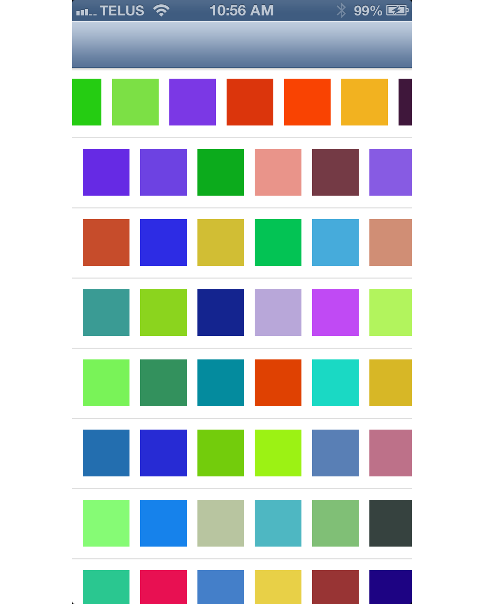

AFTabledCollectionView
======================

Demonstrates how to display a `UICollectionView` within a `UITableViewCell`. This is tricky because you want to properly architect things and have a clear separation of concern (eg: you *don't* want your `UITableViewCell` to be a `UICollectionViewDataSource`). 

Check out [my tutorial](http://ashfurrow.com/blog/putting-a-uicollectionview-in-a-uitableviewcell) for more info.

There is also a [Swift version](https://github.com/DahanHu/DHCollectionTableView) that shows off the new language. 
